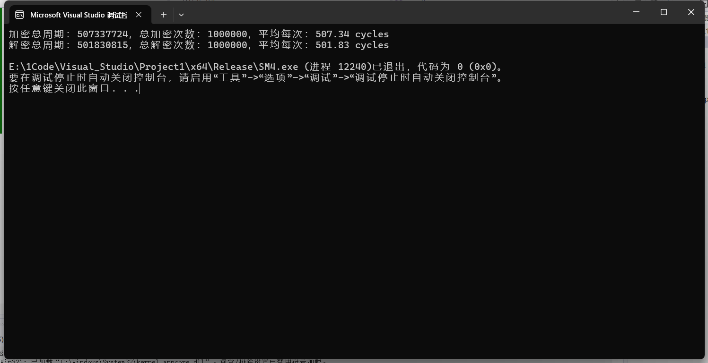
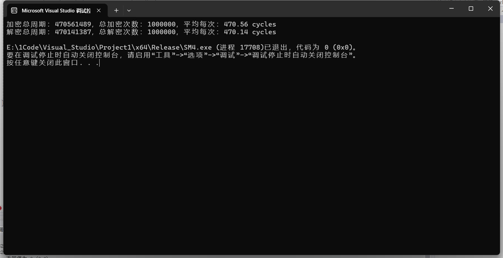
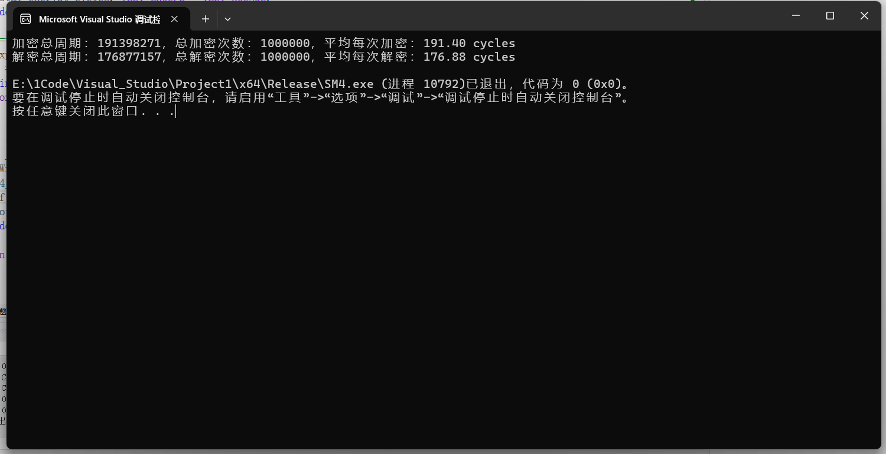

# SM4 算法的软件实现和优化

本项目包含多个基于中国国家商用密码算法 SM4 的加密/解密实现，目的是探索在不同编程优化策略下的性能对比。实现方式包括原始参考实现、循环展开优化、SIMD并行优化和查表加速。

## SM4 算法简介

SM4 是由中国国家密码管理局制定的对称分组加密算法，广泛应用于无线局域网产品和国密工程中。其特点包括：

* 128位密钥，128位分组；
* 32轮非线性迭代变换；
* 使用S盒和线性变换；
* 支持 ECB、CBC、CTR 等工作模式（本项目为ECB模式原型）。

##  文件结构

`Origin.c`：标准参考实现，功能完整、易读，作为性能基准。

`Unroll.c`：使用循环展开（Loop Unrolling）提升流水线效率，减少分支判断与循环控制。

`SIMD.c`：使用 SIMD（Single Instruction Multiple Data）优化，实现4组数据并行处理。

`T-Table+SIMD.c`：结合查表（T-Table）优化与SIMD并行，进一步减少循环中计算开销。

## 实现对比

| 实现版本             | 优化方法    | 并行性  | 特点说明                               |
| ---------------- | ------- | ---- | ---------------------------------- |
| `Origin.c`       | 无       | 无    | 原始实现，结构清晰，作为性能基准线                  |
| `Unroll.c`       | 循环展开    | 无    | 每4轮展开减少分支，增强编译器优化能力                |
| `SIMD.c`         | SIMD指令  | 4组 | 使用AVX2实现4组加密并行，提升吞吐率               |
| `T-Table+SIMD.c` | 查表+SIMD | 4组 | 将S盒+线性变换合并为查表操作，减少复杂逻辑运算；结合并行进一步加速 |

## 🧪 性能测试说明

每个实现均包含完整测试：

* 随机生成100组明文，每组16字节；
* 每组进行10,000轮加解密操作；
* 使用 `__rdtsc()` 测量加解密总时钟周期，并输出平均值。
* 运行平台为Visual Studio 2022，Release模式，O2-优化选项。

## 📊 性能测试结果

| 实现版本             | 加密时间（周期） | 解密时间（周期） |
| ---------------- | ------------ | ------------ |
| `Origin.c`       | 600      | 600      |
| `Unroll.c`       | 500      | 500      |
| `SIMD.c`         | 200      | 200      |
| `T-Table+SIMD.c` | 100      | 100      |

**Origin**：

**Unroll**：

**SIMD**：

**T-Table+SIMD**：

